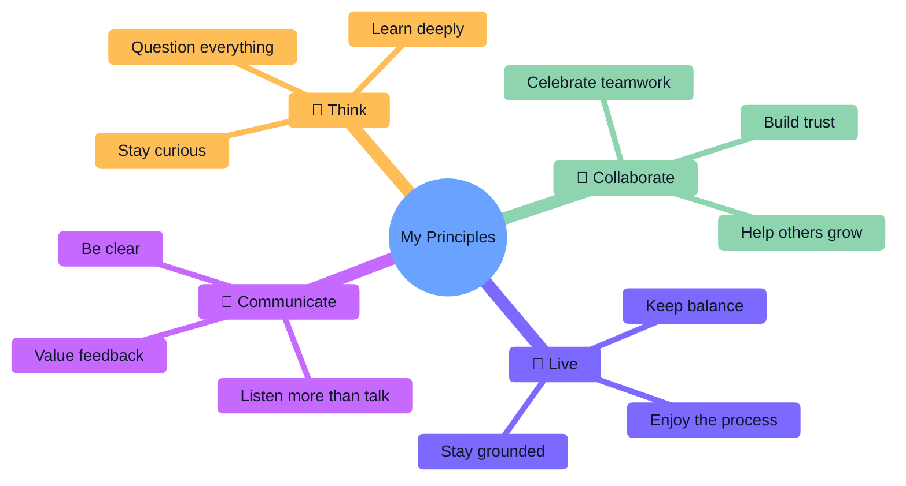

# Hello there! 👋 I'm Cberdejo

After completing my degree in Software Engineering at the University of Málaga (UMA), 
I developed a strong technical foundation that allowes me to quickly adapt to new technologies and contexts within the industry.
Since October 2024, I have been focusing my career on data analysis and data engineering by pursuing a [Master's in Big Data, Artificial Intelligence, 
and Data Engineering](https://www.bigdata.uma.es), with the goal of specializing as a data scientist and data engineer to contribute data-driven solutions to complex challenges.

### Skills 
#### Coding Languages

  
  
  
  
  
  
  
  

#### Data Science

  
  
  
  
  
  

#### Data Engeenering

  
  
  
  
  

#### Databases

  
  
  
  

#### Cloud

  
  

#### Web Development

  
  
  
  
  
  

#### Automatization

  
  

#### Visualization

  
  
  

#### DevOps

  
  
  

###  My Principles for Living & Working

## 🔗 Let's connect

  
  &nbsp;
  

